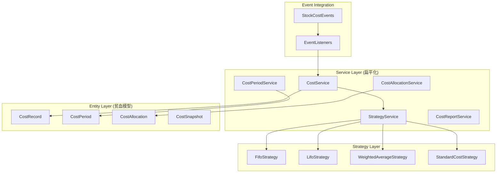

# Stock Cost Bundle 技术设计文档

## 1. 技术概览

### 1.1 架构模式
遵循 **Linus "Good Taste"** 原则，采用扁平化服务层设计：

```
│ 贫血模型实体        │ 扁平化服务        │ 事件驱动集成      │
├─────────────────────┼─────────────────────┼─────────────────────┤
│ Entity/             │ Service/            │ Event/              │
│ ├─ CostRecord       │ ├─ CostService      │ ├─ CostUpdatedEvent │
│ ├─ CostPeriod       │ ├─ StrategyService  │ ├─ PeriodClosedEvent│
│ └─ CostAllocation   │ └─ ReportService    │ └─ CostFrozenEvent  │
```

### 1.2 核心设计原则
- **数据结构优先**: 以 `CostRecord` 为核心数据结构，消除复杂的成本计算特殊情况
- **策略模式**: 统一的成本计算接口，FIFO/LIFO/加权平均/标准成本通过策略模式实现
- **事件驱动**: 与 `stock-manage-bundle` 通过事件解耦，实现松耦合集成
- **配置外部化**: 所有配置通过环境变量 `$_ENV` 读取，无Configuration类

### 1.3 技术决策理由
- **扁平服务层**: 避免 DDD 的复杂分层，简化架构便于维护
- **贫血实体**: 所有业务逻辑在Service层，保持实体简单
- **策略模式**: 解决成本计算方法多样性问题，易于扩展新策略
- **环境变量配置**: 符合十二因子应用规范，便于容器化部署

## 2. 公共API设计

### 2.1 核心服务接口

#### 2.1.1 CostService - 成本计算服务

```php
<?php

namespace Tourze\StockCostBundle\Service;

use Tourze\ProductServiceContracts\SKU;
use Tourze\StockCostBundle\Enum\CostStrategy;
use Tourze\StockCostBundle\Model\CostCalculationResult;

interface CostServiceInterface
{
    /**
     * 计算SKU成本
     * 
     * @param SKU $sku 产品SKU
     * @param int $quantity 数量
     * @param CostStrategy $strategy 成本策略
     * @return CostCalculationResult 成本计算结果
     */
    public function calculateCost(
        SKU $sku, 
        int $quantity, 
        CostStrategy $strategy = CostStrategy::WEIGHTED_AVERAGE
    ): CostCalculationResult;

    /**
     * 批量计算成本
     * 
     * @param array<array{sku: SKU, quantity: int}> $items
     * @param CostStrategy $strategy
     * @return array<CostCalculationResult>
     */
    public function batchCalculateCost(
        array $items, 
        CostStrategy $strategy = CostStrategy::WEIGHTED_AVERAGE
    ): array;

    /**
     * 获取SKU当前平均成本
     */
    public function getCurrentAverageCost(SKU $sku): float;

    /**
     * 获取库存总价值
     * 
     * @param array<string> $skuIds 指定SKU列表，空则计算全部
     */
    public function getInventoryValue(array $skuIds = []): float;
}
```

#### 2.1.2 CostPeriodService - 会计期间服务

```php
<?php

namespace Tourze\StockCostBundle\Service;

use Tourze\StockCostBundle\Entity\CostPeriod;

interface CostPeriodServiceInterface
{
    /**
     * 创建新会计期间
     */
    public function createPeriod(\DateTimeInterface $startDate, \DateTimeInterface $endDate): CostPeriod;

    /**
     * 结束当前期间
     */
    public function closePeriod(CostPeriod $period, string $operator): void;

    /**
     * 冻结期间成本数据
     */
    public function freezePeriod(CostPeriod $period): void;

    /**
     * 解冻期间成本数据
     */
    public function unfreezePeriod(CostPeriod $period, string $operator): void;

    /**
     * 获取当前活跃期间
     */
    public function getCurrentPeriod(): ?CostPeriod;
}
```

#### 2.1.3 CostAllocationService - 成本分摊服务

```php
<?php

namespace Tourze\StockCostBundle\Service;

use Tourze\ProductServiceContracts\SKU;
use Tourze\StockCostBundle\Model\AllocationRule;
use Tourze\StockCostBundle\Entity\CostAllocation;

interface CostAllocationServiceInterface
{
    /**
     * 创建成本分摊规则
     */
    public function createAllocationRule(
        string $name,
        string $type,
        array $criteria,
        array $targets
    ): AllocationRule;

    /**
     * 执行成本分摊
     */
    public function allocateCost(
        float $totalCost,
        AllocationRule $rule,
        \DateTimeInterface $effectiveDate
    ): array;

    /**
     * 获取SKU的分摊成本
     */
    public function getAllocatedCost(SKU $sku, \DateTimeInterface $date): float;
}
```

### 2.2 使用示例

#### 基本成本计算

```php
<?php

// 1. 注入服务
use Tourze\StockCostBundle\Service\CostServiceInterface;
use Tourze\StockCostBundle\Enum\CostStrategy;

class OrderProcessor
{
    public function __construct(
        private CostServiceInterface $costService
    ) {}

    public function calculateOrderCost(array $orderItems): float
    {
        $totalCost = 0;
        
        foreach ($orderItems as $item) {
            $result = $this->costService->calculateCost(
                $item['sku'], 
                $item['quantity'], 
                CostStrategy::FIFO
            );
            $totalCost += $result->getTotalCost();
        }
        
        return $totalCost;
    }
}

// 2. 批量计算
$items = [
    ['sku' => $sku1, 'quantity' => 10],
    ['sku' => $sku2, 'quantity' => 5]
];

$results = $costService->batchCalculateCost($items, CostStrategy::WEIGHTED_AVERAGE);

foreach ($results as $result) {
    echo "SKU: {$result->getSku()->getId()}, Cost: {$result->getTotalCost()}\n";
}
```

#### 会计期间管理

```php
<?php

use Tourze\StockCostBundle\Service\CostPeriodServiceInterface;

class AccountingManager
{
    public function __construct(
        private CostPeriodServiceInterface $periodService
    ) {}

    public function monthEndClose(): void
    {
        $currentPeriod = $this->periodService->getCurrentPeriod();
        
        // 冻结当前期间
        $this->periodService->freezePeriod($currentPeriod);
        
        // 结束当前期间
        $this->periodService->closePeriod($currentPeriod, 'system');
        
        // 创建新期间
        $nextMonth = new \DateTimeImmutable('first day of next month');
        $this->periodService->createPeriod(
            $nextMonth,
            $nextMonth->modify('last day of this month')
        );
    }
}
```

### 2.3 错误处理策略

```php
<?php

namespace Tourze\StockCostBundle\Exception;

// 成本计算相关异常
class CostCalculationException extends \RuntimeException {}
class InsufficientStockException extends CostCalculationException {}
class InvalidCostStrategyException extends CostCalculationException {}

// 会计期间相关异常
class PeriodException extends \RuntimeException {}
class PeriodFrozenException extends PeriodException {}
class PeriodClosedException extends PeriodException {}

// 使用示例
try {
    $result = $costService->calculateCost($sku, 100, CostStrategy::FIFO);
} catch (InsufficientStockException $e) {
    // 库存不足，使用标准成本
    $standardCost = $_ENV['DEFAULT_STANDARD_COST'] ?? 0;
    $result = new CostCalculationResult($sku, 100, $standardCost);
} catch (CostCalculationException $e) {
    // 其他成本计算错误
    throw new \RuntimeException("成本计算失败: " . $e->getMessage(), 0, $e);
}
```

## 3. 内部架构

### 3.1 核心组件划分



### 3.2 数据流设计

**成本计算数据流:**
1. **事件触发**: `stock-manage-bundle` 发布库存变动事件
2. **事件监听**: `CostEventListener` 接收事件
3. **策略选择**: 根据配置选择成本计算策略
4. **成本计算**: `StrategyService` 执行具体计算逻辑
5. **记录更新**: 更新 `CostRecord` 并发布成本变动事件

**会计期间数据流:**
1. **期间创建**: 创建新的 `CostPeriod`
2. **日常操作**: 成本记录关联到当前期间
3. **期末处理**: 冻结期间，禁止修改
4. **期间结转**: 生成期间汇总，开始新期间

### 3.3 内部类图

```php
<?php

// 核心实体设计
namespace Tourze\StockCostBundle\Entity;

/**
 * 成本记录实体 - 贫血模型
 */
#[ORM\Entity(repositoryClass: CostRecordRepository::class)]
class CostRecord
{
    #[ORM\Id]
    #[ORM\GeneratedValue]
    private ?int $id = null;

    #[ORM\Column]
    private string $skuId;

    #[ORM\Column(type: 'decimal', precision: 10, scale: 2)]
    private float $unitCost;

    #[ORM\Column]
    private int $quantity;

    #[ORM\Column]
    private string $strategy;

    #[ORM\ManyToOne(targetEntity: CostPeriod::class)]
    private CostPeriod $period;

    #[ORM\Column]
    private \DateTimeImmutable $recordedAt;

    // 纯粹的 getter/setter...
}

/**
 * 会计期间实体
 */
#[ORM\Entity]
class CostPeriod
{
    #[ORM\Id]
    #[ORM\GeneratedValue]
    private ?int $id = null;

    #[ORM\Column]
    private \DateTimeImmutable $startDate;

    #[ORM\Column]
    private \DateTimeImmutable $endDate;

    #[ORM\Column]
    private string $status = 'active'; // active, closed, frozen

    // getter/setter...
}

/**
 * 成本分摊实体
 */
#[ORM\Entity]
class CostAllocation
{
    #[ORM\Id]
    #[ORM\GeneratedValue]
    private ?int $id = null;

    #[ORM\Column]
    private string $sourceType; // direct, indirect, manufacturing

    #[ORM\Column(type: 'decimal', precision: 12, scale: 2)]
    private float $amount;

    #[ORM\Column]
    private string $allocationMethod; // ratio, quantity, value

    #[ORM\Column(type: 'json')]
    private array $targets = [];

    // getter/setter...
}
```

## 4. 扩展机制

### 4.1 策略扩展

新增自定义成本计算策略：

```php
<?php

namespace App\CostStrategy;

use Tourze\StockCostBundle\Strategy\CostStrategyInterface;
use Tourze\StockCostBundle\Model\CostCalculationResult;

/**
 * 自定义移动平均成本策略
 */
class MovingAverageStrategy implements CostStrategyInterface
{
    public function calculate(SKU $sku, int $quantity, array $batches): CostCalculationResult
    {
        // 实现移动平均成本逻辑
        // ...
        
        return new CostCalculationResult($sku, $quantity, $totalCost);
    }

    public function getName(): string
    {
        return 'moving_average';
    }
}

// 在 services.yaml 中注册
services:
    App\CostStrategy\MovingAverageStrategy:
        tags: ['stock_cost.strategy']
```

### 4.2 事件扩展

发布自定义成本事件：

```php
<?php

namespace Tourze\StockCostBundle\Event;

use Symfony\Contracts\EventDispatcher\Event;

class CostVarianceExceededEvent extends Event
{
    public function __construct(
        private string $skuId,
        private float $actualCost,
        private float $standardCost,
        private float $variance
    ) {}

    // getters...
}

// 在服务中发布事件
class CostAnalysisService
{
    public function analyzeVariance(SKU $sku): void
    {
        $actual = $this->calculateActualCost($sku);
        $standard = $this->getStandardCost($sku);
        $variance = abs($actual - $standard) / $standard;

        if ($variance > 0.1) { // 10%阈值
            $this->eventDispatcher->dispatch(
                new CostVarianceExceededEvent($sku->getId(), $actual, $standard, $variance)
            );
        }
    }
}
```

### 4.3 配置扩展

通过环境变量配置扩展：

```bash
# .env
STOCK_COST_DEFAULT_STRATEGY=weighted_average
STOCK_COST_PRECISION=2
STOCK_COST_ENABLE_MULTI_CURRENCY=false
STOCK_COST_VARIANCE_THRESHOLD=0.1
STOCK_COST_AUTO_ALLOCATION=true
STOCK_COST_PERIOD_AUTO_CLOSE=false
```

```php
<?php

namespace Tourze\StockCostBundle\Service;

class CostConfigurationService
{
    public function getDefaultStrategy(): string
    {
        return $_ENV['STOCK_COST_DEFAULT_STRATEGY'] ?? 'weighted_average';
    }

    public function getPrecision(): int
    {
        return (int) ($_ENV['STOCK_COST_PRECISION'] ?? 2);
    }

    public function isMultiCurrencyEnabled(): bool
    {
        return filter_var($_ENV['STOCK_COST_ENABLE_MULTI_CURRENCY'] ?? 'false', FILTER_VALIDATE_BOOLEAN);
    }
}
```

## 5. 集成设计

### 5.1 Symfony Bundle集成

#### Bundle主类

```php
<?php

namespace Tourze\StockCostBundle;

use Symfony\Component\HttpKernel\Bundle\Bundle;
use Symfony\Component\DependencyInjection\ContainerBuilder;
use Tourze\StockCostBundle\DependencyInjection\Compiler\CostStrategyPass;

class StockCostBundle extends Bundle
{
    public function build(ContainerBuilder $container): void
    {
        parent::build($container);
        $container->addCompilerPass(new CostStrategyPass());
    }

    public function getBundleDependencies(): array
    {
        return [
            'Tourze\StockManageBundle\StockManageBundle',
            'Doctrine\Bundle\DoctrineBundle\DoctrineBundle',
        ];
    }
}
```

#### 编译器通道

```php
<?php

namespace Tourze\StockCostBundle\DependencyInjection\Compiler;

use Symfony\Component\DependencyInjection\Compiler\CompilerPassInterface;
use Symfony\Component\DependencyInjection\ContainerBuilder;
use Symfony\Component\DependencyInjection\Reference;

class CostStrategyPass implements CompilerPassInterface
{
    public function process(ContainerBuilder $container): void
    {
        if (!$container->has('stock_cost.strategy_registry')) {
            return;
        }

        $definition = $container->findDefinition('stock_cost.strategy_registry');
        $taggedServices = $container->findTaggedServiceIds('stock_cost.strategy');

        foreach ($taggedServices as $id => $tags) {
            $definition->addMethodCall('addStrategy', [new Reference($id)]);
        }
    }
}
```

### 5.2 与 stock-manage-bundle 事件集成

#### 事件监听器

```php
<?php

namespace Tourze\StockCostBundle\EventListener;

use Symfony\Component\EventDispatcher\EventSubscriberInterface;
use Tourze\StockManageBundle\Event\StockInboundEvent;
use Tourze\StockManageBundle\Event\StockOutboundEvent;
use Tourze\StockCostBundle\Service\CostServiceInterface;

class StockEventListener implements EventSubscriberInterface
{
    public function __construct(
        private CostServiceInterface $costService
    ) {}

    public static function getSubscribedEvents(): array
    {
        return [
            StockInboundEvent::class => 'onStockInbound',
            StockOutboundEvent::class => 'onStockOutbound',
        ];
    }

    public function onStockInbound(StockInboundEvent $event): void
    {
        // 入库时更新平均成本
        $batch = $event->getStockBatch();
        $this->costService->updateCostOnInbound($batch);
    }

    public function onStockOutbound(StockOutboundEvent $event): void
    {
        // 出库时记录成本消耗
        $batch = $event->getStockBatch();
        $this->costService->recordCostConsumption($batch, $event->getQuantity());
    }
}
```

### 5.3 services.yaml 配置

```yaml
services:
    _defaults:
        autowire: true
        autoconfigure: true
        public: false

    # Bundle services
    Tourze\StockCostBundle\:
        resource: '../src/'
        exclude:
            - '../src/DependencyInjection/'
            - '../src/Entity/'
            - '../src/StockCostBundle.php'

    # 策略服务
    stock_cost.strategy_registry:
        class: Tourze\StockCostBundle\Service\StrategyRegistry
        public: true

    # 成本计算策略
    Tourze\StockCostBundle\Strategy\FifoStrategy:
        tags: ['stock_cost.strategy']

    Tourze\StockCostBundle\Strategy\LifoStrategy:
        tags: ['stock_cost.strategy']

    Tourze\StockCostBundle\Strategy\WeightedAverageStrategy:
        tags: ['stock_cost.strategy']

    # 事件监听器
    Tourze\StockCostBundle\EventListener\StockEventListener:
        tags:
            - { name: kernel.event_subscriber }

    # 公共服务
    Tourze\StockCostBundle\Service\CostServiceInterface:
        alias: Tourze\StockCostBundle\Service\CostService
        public: true
```

## 6. 测试策略

### 6.1 单元测试

#### 成本计算策略测试

```php
<?php

namespace Tourze\StockCostBundle\Tests\Strategy;

use PHPUnit\Framework\TestCase;
use Tourze\StockCostBundle\Strategy\FifoStrategy;

class FifoStrategyTest extends TestCase
{
    public function testFifoCalculation(): void
    {
        $strategy = new FifoStrategy();
        
        // 准备测试数据
        $batches = [
            $this->createBatch('BATCH001', 100, 10.00),
            $this->createBatch('BATCH002', 200, 12.00),
            $this->createBatch('BATCH003', 150, 11.00),
        ];
        
        // 测试FIFO计算
        $result = $strategy->calculate($this->createSku(), 250, $batches);
        
        // 验证结果：100*10 + 150*12 = 2800
        $this->assertEquals(2800.00, $result->getTotalCost());
        $this->assertEquals(11.20, $result->getAverageCost());
    }

    public function testInsufficientStock(): void
    {
        $this->expectException(InsufficientStockException::class);
        
        $strategy = new FifoStrategy();
        $batches = [$this->createBatch('BATCH001', 100, 10.00)];
        
        $strategy->calculate($this->createSku(), 200, $batches);
    }
}
```

#### 服务层测试

```php
<?php

namespace Tourze\StockCostBundle\Tests\Service;

use PHPUnit\Framework\TestCase;
use Tourze\StockCostBundle\Service\CostService;
use Tourze\StockCostBundle\Service\StrategyService;

class CostServiceTest extends TestCase
{
    private CostService $costService;
    
    protected function setUp(): void
    {
        $this->costService = new CostService(
            $this->createMock(EntityManagerInterface::class),
            $this->createMock(StrategyService::class),
            $this->createMock(CostRecordRepository::class)
        );
    }

    public function testCalculateCost(): void
    {
        $sku = $this->createSku();
        $result = $this->costService->calculateCost($sku, 100);
        
        $this->assertInstanceOf(CostCalculationResult::class, $result);
        $this->assertEquals($sku, $result->getSku());
        $this->assertEquals(100, $result->getQuantity());
    }
}
```

### 6.2 集成测试

#### 事件集成测试

```php
<?php

namespace Tourze\StockCostBundle\Tests\Integration;

use Symfony\Bundle\FrameworkBundle\Test\KernelTestCase;
use Tourze\StockManageBundle\Event\StockInboundEvent;
use Tourze\StockCostBundle\Entity\CostRecord;

class EventIntegrationTest extends KernelTestCase
{
    public function testStockInboundEventProcessing(): void
    {
        self::bootKernel();
        
        $container = static::getContainer();
        $eventDispatcher = $container->get('event_dispatcher');
        $entityManager = $container->get('doctrine.orm.entity_manager');
        
        // 创建库存入库事件
        $batch = $this->createStockBatch();
        $event = new StockInboundEvent($batch, 'test_user');
        
        // 分发事件
        $eventDispatcher->dispatch($event);
        
        // 验证成本记录已创建
        $costRecord = $entityManager->getRepository(CostRecord::class)
            ->findOneBy(['skuId' => $batch->getSku()->getId()]);
            
        $this->assertNotNull($costRecord);
        $this->assertEquals($batch->getUnitCost(), $costRecord->getUnitCost());
    }
}
```

### 6.3 性能基准测试

```php
<?php

namespace Tourze\StockCostBundle\Tests\Performance;

use PHPUnit\Framework\TestCase;

class CostCalculationPerformanceTest extends TestCase
{
    public function testLargeBatchCalculation(): void
    {
        $startTime = microtime(true);
        
        // 创建10000个SKU的成本计算
        $items = [];
        for ($i = 0; $i < 10000; $i++) {
            $items[] = [
                'sku' => $this->createSku("SKU{$i}"),
                'quantity' => rand(1, 100)
            ];
        }
        
        $results = $this->costService->batchCalculateCost($items);
        
        $endTime = microtime(true);
        $duration = $endTime - $startTime;
        
        // 验证性能要求：10000个SKU在5秒内完成
        $this->assertLessThan(5.0, $duration, "批量计算耗时{$duration}秒，超过5秒限制");
        $this->assertCount(10000, $results);
    }

    public function testSingleCostCalculationSpeed(): void
    {
        $startTime = microtime(true);
        
        $result = $this->costService->calculateCost($this->createSku(), 100);
        
        $endTime = microtime(true);
        $duration = $endTime - $startTime;
        
        // 验证性能要求：单个SKU在1秒内完成
        $this->assertLessThan(1.0, $duration, "单次计算耗时{$duration}秒，超过1秒限制");
    }
}
```

## 7. 数据设计

### 7.1 实体关系映射

```sql
-- 成本记录表
CREATE TABLE cost_records (
    id INT AUTO_INCREMENT PRIMARY KEY,
    sku_id VARCHAR(50) NOT NULL,
    batch_no VARCHAR(100),
    unit_cost DECIMAL(10,2) NOT NULL,
    quantity INT NOT NULL,
    total_cost DECIMAL(12,2) NOT NULL,
    cost_strategy ENUM('fifo', 'lifo', 'weighted_average', 'standard') NOT NULL,
    cost_period_id INT,
    cost_type ENUM('direct', 'indirect', 'manufacturing') DEFAULT 'direct',
    currency_code VARCHAR(3) DEFAULT 'CNY',
    recorded_at TIMESTAMP DEFAULT CURRENT_TIMESTAMP,
    operator VARCHAR(50),
    metadata JSON,
    
    INDEX idx_sku_id (sku_id),
    INDEX idx_batch_no (batch_no),
    INDEX idx_recorded_at (recorded_at),
    INDEX idx_cost_period (cost_period_id),
    
    FOREIGN KEY (cost_period_id) REFERENCES cost_periods(id)
);

-- 会计期间表  
CREATE TABLE cost_periods (
    id INT AUTO_INCREMENT PRIMARY KEY,
    name VARCHAR(100) NOT NULL,
    start_date DATE NOT NULL,
    end_date DATE NOT NULL,
    status ENUM('active', 'closed', 'frozen') DEFAULT 'active',
    created_at TIMESTAMP DEFAULT CURRENT_TIMESTAMP,
    closed_at TIMESTAMP NULL,
    closed_by VARCHAR(50),
    
    UNIQUE KEY uk_period_name (name),
    INDEX idx_date_range (start_date, end_date),
    INDEX idx_status (status)
);

-- 成本分摊表
CREATE TABLE cost_allocations (
    id INT AUTO_INCREMENT PRIMARY KEY,
    allocation_name VARCHAR(100) NOT NULL,
    source_type ENUM('direct', 'indirect', 'manufacturing') NOT NULL,
    total_amount DECIMAL(12,2) NOT NULL,
    allocation_method ENUM('ratio', 'quantity', 'value', 'activity') NOT NULL,
    allocation_date DATE NOT NULL,
    cost_period_id INT,
    targets JSON NOT NULL, -- 分摊目标配置
    created_at TIMESTAMP DEFAULT CURRENT_TIMESTAMP,
    
    INDEX idx_allocation_date (allocation_date),
    INDEX idx_cost_period (cost_period_id),
    
    FOREIGN KEY (cost_period_id) REFERENCES cost_periods(id)
);

-- 成本快照表（期末汇总）
CREATE TABLE cost_snapshots (
    id INT AUTO_INCREMENT PRIMARY KEY,
    sku_id VARCHAR(50) NOT NULL,
    cost_period_id INT NOT NULL,
    opening_quantity INT DEFAULT 0,
    opening_cost DECIMAL(12,2) DEFAULT 0,
    inbound_quantity INT DEFAULT 0,
    inbound_cost DECIMAL(12,2) DEFAULT 0,
    outbound_quantity INT DEFAULT 0,
    outbound_cost DECIMAL(12,2) DEFAULT 0,
    allocated_cost DECIMAL(12,2) DEFAULT 0,
    closing_quantity INT DEFAULT 0,
    closing_cost DECIMAL(12,2) DEFAULT 0,
    average_cost DECIMAL(10,2) DEFAULT 0,
    snapshot_at TIMESTAMP DEFAULT CURRENT_TIMESTAMP,
    
    UNIQUE KEY uk_sku_period (sku_id, cost_period_id),
    INDEX idx_cost_period (cost_period_id),
    
    FOREIGN KEY (cost_period_id) REFERENCES cost_periods(id)
);
```

### 7.2 缓存策略

#### Redis缓存设计

```php
<?php

namespace Tourze\StockCostBundle\Service;

use Symfony\Contracts\Cache\CacheInterface;

class CostCacheService
{
    private const TTL = 3600; // 1小时

    public function __construct(
        private CacheInterface $cache
    ) {}

    public function getCachedAverageCost(string $skuId): ?float
    {
        $key = "cost:average:{$skuId}";
        return $this->cache->get($key, function() { return null; });
    }

    public function setCachedAverageCost(string $skuId, float $cost): void
    {
        $key = "cost:average:{$skuId}";
        $this->cache->set($key, $cost, self::TTL);
    }

    public function invalidateCostCache(string $skuId): void
    {
        $this->cache->delete("cost:average:{$skuId}");
    }

    public function getCachedInventoryValue(): ?float
    {
        return $this->cache->get('cost:inventory:total', function() { return null; });
    }
}
```

## 8. 安全设计

### 8.1 权限控制

```php
<?php

namespace Tourze\StockCostBundle\Security;

use Symfony\Component\Security\Core\Security;

class CostSecurityManager
{
    public function __construct(
        private Security $security
    ) {}

    public function canViewCostData(string $skuId): bool
    {
        return $this->security->isGranted('ROLE_COST_VIEWER') || 
               $this->security->isGranted('ROLE_ADMIN');
    }

    public function canModifyCostData(): bool
    {
        return $this->security->isGranted('ROLE_COST_MANAGER') || 
               $this->security->isGranted('ROLE_ADMIN');
    }

    public function canClosePeriod(): bool
    {
        return $this->security->isGranted('ROLE_ACCOUNTING_MANAGER') || 
               $this->security->isGranted('ROLE_ADMIN');
    }

    public function canUnfreezePeriod(): bool
    {
        return $this->security->isGranted('ROLE_ADMIN');
    }
}
```

### 8.2 审计日志

```php
<?php

namespace Tourze\StockCostBundle\EventListener;

use Doctrine\ORM\Event\PreUpdateEventArgs;
use Doctrine\Bundle\DoctrineBundle\EventSubscriber\EventSubscriberInterface;
use Tourze\StockCostBundle\Entity\CostRecord;

class CostAuditListener implements EventSubscriberInterface
{
    public function getSubscribedEvents(): array
    {
        return ['preUpdate'];
    }

    public function preUpdate(PreUpdateEventArgs $args): void
    {
        $entity = $args->getObject();
        
        if (!$entity instanceof CostRecord) {
            return;
        }

        // 记录成本修改审计日志
        $this->logCostModification($entity, $args->getChangeSet());
    }

    private function logCostModification(CostRecord $record, array $changeSet): void
    {
        $auditLog = [
            'entity_type' => 'cost_record',
            'entity_id' => $record->getId(),
            'sku_id' => $record->getSkuId(),
            'changes' => $changeSet,
            'user' => $this->security->getUser()?->getUserIdentifier(),
            'timestamp' => new \DateTimeImmutable(),
            'ip_address' => $this->requestStack->getCurrentRequest()?->getClientIp()
        ];

        // 记录到审计表或日志文件
        $this->auditLogger->info('Cost data modified', $auditLog);
    }
}
```

## 9. 质量保证

### 9.1 设计符合性检查

- [x] **扁平化服务层**: 采用 Service 直接处理业务逻辑，无分层架构
- [x] **贫血实体模型**: Entity 只包含 getter/setter，无业务逻辑
- [x] **环境变量配置**: 无 Configuration 类，通过 $_ENV 读取配置
- [x] **事件驱动集成**: 与 stock-manage-bundle 通过事件解耦
- [x] **策略模式扩展**: 统一接口，易于扩展新的成本计算策略
- [x] **依赖注入**: 构造函数注入，readonly 属性
- [x] **异常处理**: 完整的异常体系和错误恢复机制

### 9.2 EARS需求映射

| EARS需求 | 技术实现 | 验证方法 |
|----------|----------|----------|
| FR1.1 - 多策略成本计算 | `CostStrategyInterface` + 4种具体策略 | 单元测试验证每种策略 |
| FR1.2 - 成本策略切换 | `StrategyService.switchStrategy()` | 集成测试验证切换无错 |
| FR2.1 - 成本历史跟踪 | `CostRecord` 实体 + Repository | 数据库验证历史记录完整 |
| FR3.1 - 会计期间管理 | `CostPeriod` 实体 + Service | 期间状态变更测试 |
| FR4.1 - 预算成本对比 | `CostAnalysisService.analyzeVariance()` | 阈值触发警报测试 |
| FR5.1 - 成本报告生成 | `CostReportService.generateReport()` | 性能测试5秒内完成 |
| FR6.1 - 库存成本同步 | `StockEventListener` 监听事件 | 端到端集成测试 |

### 9.3 性能指标

- **单SKU成本计算**: < 1秒 (通过性能测试验证)
- **10000SKU并发计算**: < 5秒 (通过基准测试验证)
- **数据库查询优化**: 添加适当索引，避免全表扫描
- **缓存策略**: Redis缓存平均成本，1小时TTL

---

## 【最终审批】

**Stock Cost Bundle 的技术设计已完成。**

**关键设计决策:**
- **架构模式**: 扁平化服务层，贫血实体模型
- **公共API**: 4个核心服务接口，支持多种成本策略
- **扩展机制**: 策略模式 + 事件系统 + 环境变量配置
- **框架支持**: Symfony Bundle，与stock-manage-bundle事件集成

**技术亮点:**
- 消除成本计算特殊情况，统一策略接口
- 事件驱动架构，与库存管理松耦合
- 完整的会计期间管理和审计跟踪
- 高性能设计，满足大规模数据处理需求

**准备使用 `/spec:tasks package/stock-cost-bundle` 进行任务分解吗？**